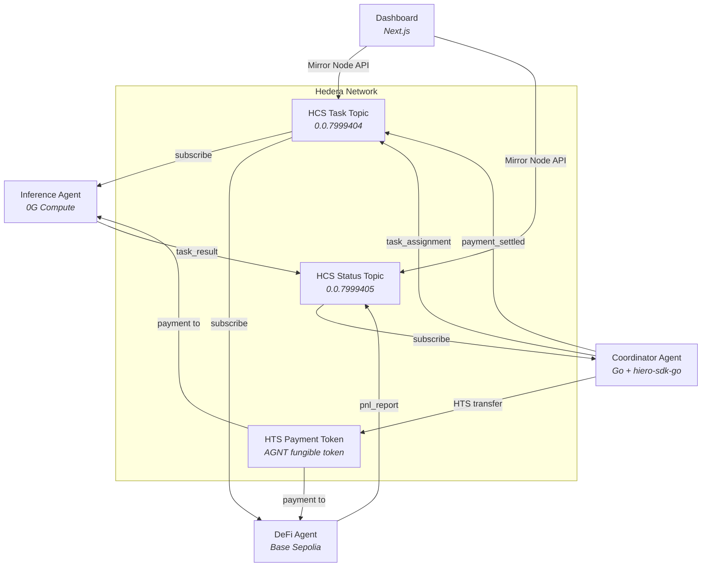

# agent-coordinator

Task orchestration agent for a multi-agent autonomous economy on Hedera.

Part of the [ETHDenver 2026 Agent Economy](../README.md) submission.

## Overview

The agent-coordinator is the brain of a three-agent autonomous economy. It reads structured task plans, assigns work to specialized AI agents via **Hedera Consensus Service (HCS)**, monitors their progress in real-time, enforces quality gates, and settles payments with **Hedera Token Service (HTS)** upon task completion.

The entire system runs without Solidity or EVM contracts. All coordination, messaging, and payments use native Hedera services through the Go SDK (`hiero-sdk-go`), demonstrating that complex multi-agent workflows can be built entirely on Hedera's native layer.

## Built with Obedience Corp

This project is part of an [Obedience Corp](https://obediencecorp.com) campaign -- built and planned using **camp** (campaign management) and **fest** (festival methodology). This repository, its git history, and the planning artifacts in `festivals/` are a live example of these tools in action.

The coordinator connects to the **obey daemon** via gRPC for sandboxed command execution. Festival plans define the task graph (phases -> sequences -> tasks) that the coordinator publishes to agents via HCS. Quality gates enforce `fest_commit` checkpoints before allowing task completion.

## Architecture



### Data Flow

1. **Coordinator** publishes `task_assignment` messages to the HCS Task Topic
2. **Inference Agent** subscribes, executes inference on 0G Compute, publishes `task_result` to the HCS Status Topic
3. **DeFi Agent** subscribes, executes trades on Base, publishes `pnl_report` to the HCS Status Topic
4. **Coordinator** receives results, validates quality, triggers HTS payment
5. **Dashboard** observes the entire flow via Hedera Mirror Node

## Quick Start

```bash
cp .env.example .env   # fill in Hedera accounts + topic/token IDs
just build
just run
```

To provision testnet infrastructure from scratch:

```bash
just hedera setup          # creates HCS topics + HTS token
just hedera show-config    # prints the generated .env values
```

## Prerequisites

- Go 1.24+
- 3 Hedera testnet accounts -- coordinator (treasury) + 2 agents ([portal.hedera.com](https://portal.hedera.com))
- HCS topics and HTS token (created via `just hedera setup`)

## Configuration

| Variable | Description |
|----------|-------------|
| `HEDERA_NETWORK` | Network name (`testnet`) |
| `HEDERA_COORDINATOR_ACCOUNT_ID` | Coordinator / treasury account |
| `HEDERA_COORDINATOR_PRIVATE_KEY` | Coordinator private key |
| `HEDERA_AGENT1_ACCOUNT_ID` | Inference agent account |
| `HEDERA_AGENT1_PRIVATE_KEY` | Inference agent key |
| `HEDERA_AGENT2_ACCOUNT_ID` | DeFi agent account |
| `HEDERA_AGENT2_PRIVATE_KEY` | DeFi agent key |
| `HCS_TASK_TOPIC_ID` | HCS topic for task assignments |
| `HCS_STATUS_TOPIC_ID` | HCS topic for status updates |
| `HTS_PAYMENT_TOKEN_ID` | HTS fungible token for payments |
| `DAEMON_ADDRESS` | Daemon gRPC address (default: localhost:50051) |
| `DAEMON_TLS_ENABLED` | Enable TLS for daemon connection |

## HCS Message Protocol

All inter-agent communication happens through HCS messages with JSON payloads. Messages are immutable, timestamped, and ordered by the Hedera network.

| Type | Direction | Topic | Description |
|------|-----------|-------|-------------|
| `task_assignment` | Coordinator -> Agent | Task | Assigns a task with model, input, and parameters |
| `status_update` | Agent -> Coordinator | Status | Reports task progress |
| `task_result` | Agent -> Coordinator | Status | Delivers inference output or trade result |
| `pnl_report` | DeFi Agent -> Coordinator | Status | Profit/loss metrics from executed trades |
| `heartbeat` | Agent -> Coordinator | Status | Liveness signal with agent metadata |
| `quality_gate` | Coordinator -> Agent | Task | Quality check enforcement |
| `payment_settled` | Coordinator -> Agent | Task | HTS payment confirmation with tx hash |

Task state machine: `pending` -> `assigned` -> `in_progress` -> `review` -> `complete` -> `paid`

## Project Structure

```
cmd/
  coordinator/             Coordinator entry point
  setup-testnet/           Provisions HCS topics + HTS token
internal/
  config/                  Config loading and validation
  coordinator/             Assigner, monitor, payment, result handler, quality gates
  daemon/                  Daemon RPC client
  festival/                Festival plan reader
  hedera/
    hcs/                   HCS publisher, subscriber, topic lifecycle
    hts/                   HTS token creation and transfer
  integration/             E2E integration test helpers
pkg/daemon/                Shared daemon proto bindings
proto/                     Protobuf definitions
docs/integration/          Integration test evidence and logs
```

## Development

```bash
just build                 # Build binary to bin/
just run                   # Run the coordinator
just test                  # Run tests
just lint                  # golangci-lint
just hedera setup          # Provision HCS topics + HTS token
just hedera e2e            # Full E2E integration test
just hedera verify-topics  # Check topic/token existence
just hedera show-config    # Display Hedera env vars
```

## Internal Architecture

`main.go` initializes the Hedera client, config, and all coordinator services via dependency injection:

- **Assigner** -- publishes task assignments to agents via HCS with model/input parameters
- **Monitor** -- background goroutine listening on the status topic for heartbeats and progress updates
- **ResultHandler** -- processes `task_result` and `pnl_report` messages, triggers payment on completion
- **Payment** -- executes HTS token transfers from the treasury to agent accounts, publishes settlement confirmations
- **QualityGate** -- validates task completion criteria before authorizing payment

All state management is thread-safe with `sync.RWMutex`. Context propagation ensures clean shutdown across all goroutines.

## Demo Walkthrough

The demo video shows the full autonomous economy cycle:

1. **Coordinator starts** and connects to Hedera testnet, subscribing to HCS topics
2. **Inference agent starts** and subscribes to the task topic, waiting for assignments
3. **DeFi agent starts** and subscribes to the task topic, ready for trade signals
4. **Coordinator assigns a task** -- publishes a `task_assignment` to the inference agent via HCS
5. **Inference agent executes** -- discovers a provider on 0G Compute, runs inference, publishes `task_result` back via HCS
6. **DeFi agent executes** -- receives trade parameters, executes on Base Sepolia, publishes `pnl_report`
7. **Coordinator settles payment** -- verifies results, transfers HTS tokens to both agents
8. **Dashboard displays** the entire flow in real-time via Hedera Mirror Node

## Hedera Track 3 Alignment

**Track 3: "No Solidity Allowed"** requires at least two native Hedera capabilities with zero Solidity or EVM contracts.

| Requirement | How This Project Meets It |
|------------|---------------------------|
| **At least two native Hedera services** | Uses both **HCS** (agent messaging) and **HTS** (payment settlement) |
| **No Solidity or EVM contracts** | All Hedera interactions use the native Go SDK (`hiero-sdk-go v2.75.0`). Zero smart contracts deployed on Hedera. |
| **Working testnet app** | Fully operational on Hedera testnet with provisioned topics and tokens |
| **Native SDK usage** | Built entirely with `github.com/hiero-ledger/hiero-sdk-go/v2` -- the official Go SDK |
| **Clear security model** | Private keys loaded from environment variables, never committed. Each agent has a separate Hedera account with minimal permissions. |

### Native Hedera Services Used

**HCS (Hedera Consensus Service)**
- Two topics: Task Topic (coordinator -> agents) and Status Topic (agents -> coordinator)
- All inter-agent communication flows through HCS with JSON-encoded payloads
- Messages are immutable, ordered, and timestamped by the Hedera network
- Topic lifecycle managed via `TopicCreateTransaction` (submit keys omitted on testnet, relying on account separation)

**HTS (Hedera Token Service)**
- Custom fungible token (`AGNT`) created via `TokenCreateTransaction`
- Agent accounts associated via `TokenAssociateTransaction`
- Payments settled via `TransferTransaction` from coordinator treasury to agent accounts
- Payment confirmations published back to HCS for full audit trail

**Hedera Account Management**
- Three separate testnet accounts with distinct key pairs
- Coordinator account serves as treasury and token administrator
- Agent accounts have minimal permissions (HCS submit + HTS receive)

**Schedule Service**
- Wraps any Hedera transaction in a `ScheduleCreateTransaction` for deferred execution
- Heartbeat mechanism sends periodic scheduled zero-value HBAR transfers as agent liveness proofs (configurable interval, default 30s)
- Supports both immediate and delayed scheduling with consensus timestamps

## License

MIT
