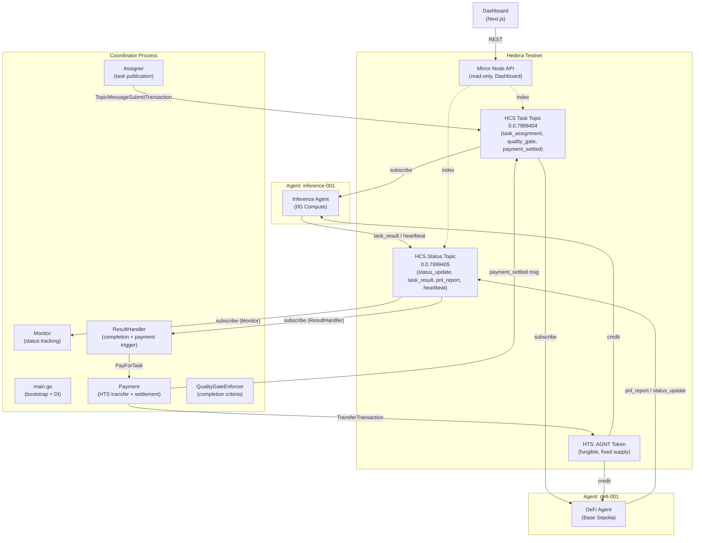
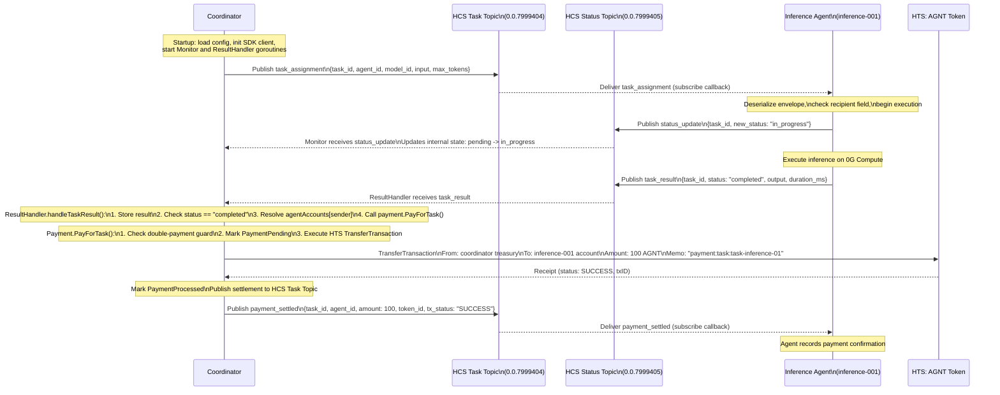
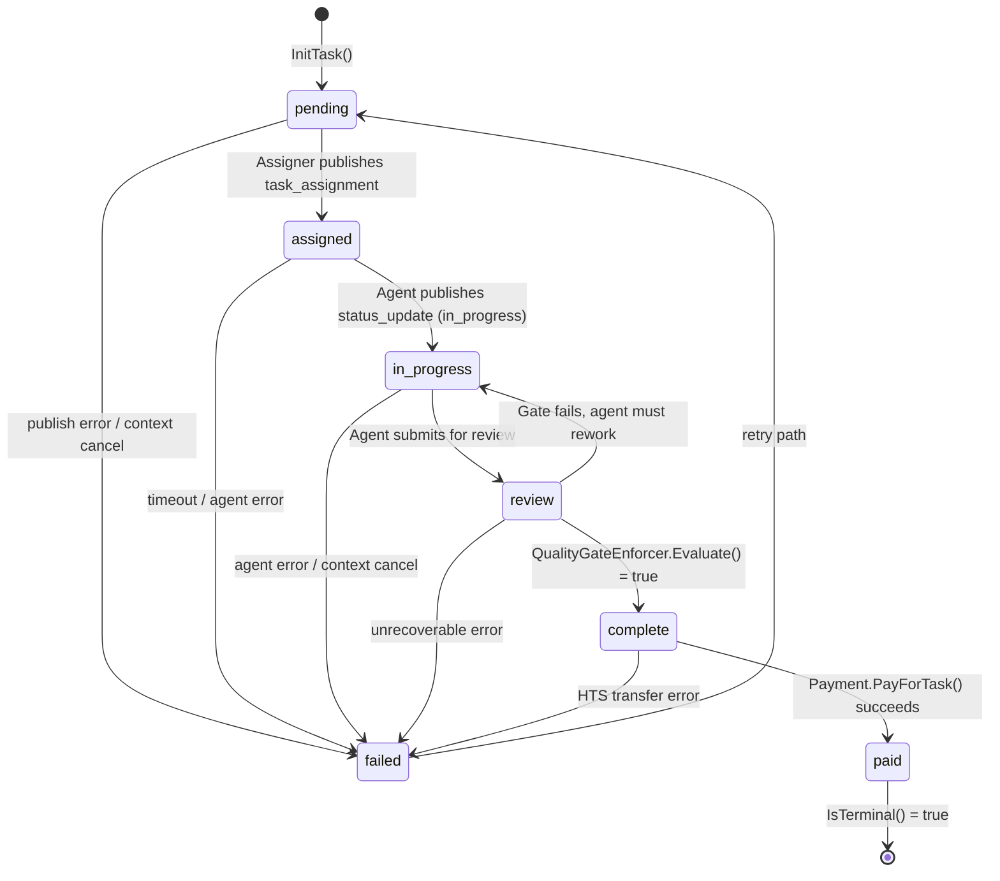
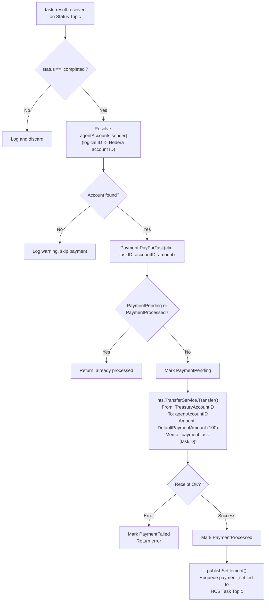
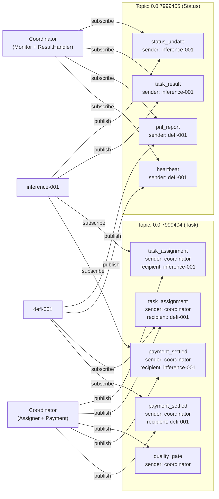
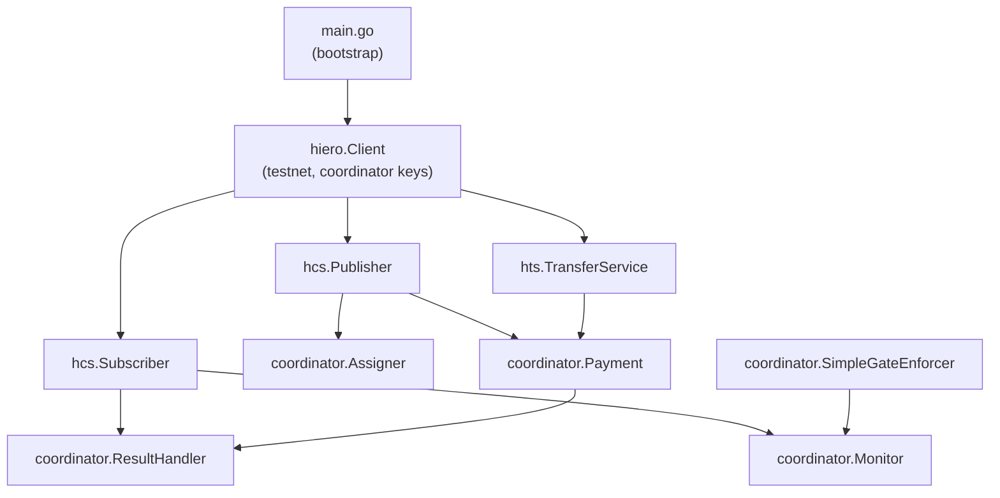
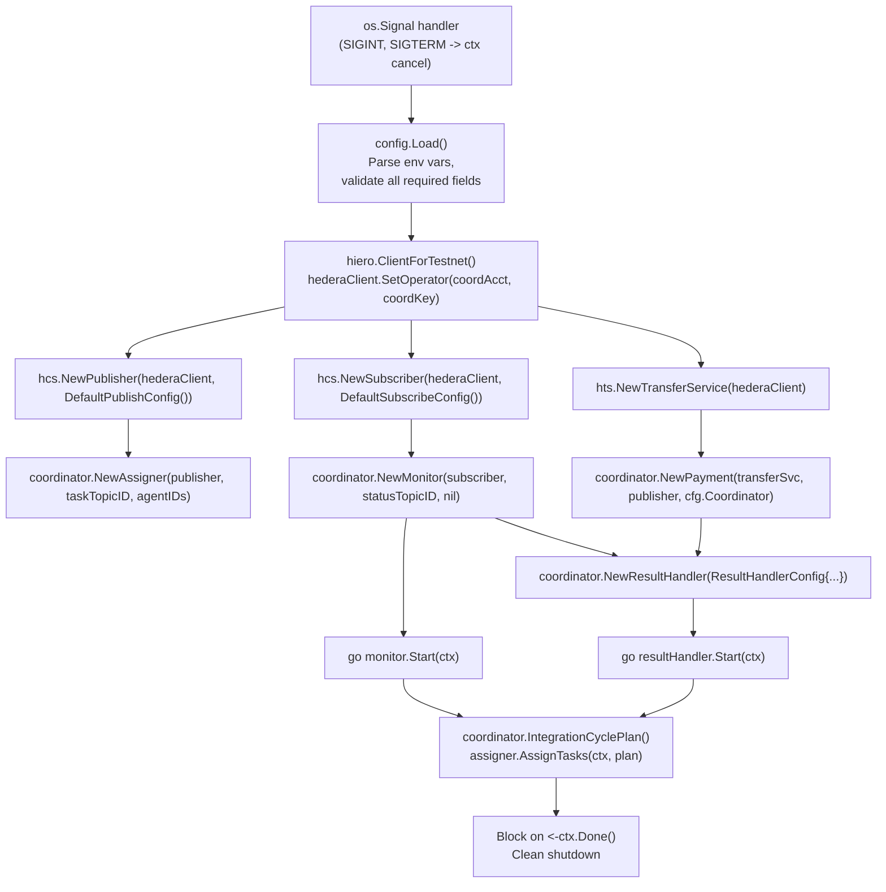

# Agent Coordinator: Architecture Reference

**ETHDenver 2026 -- Hedera Track 3: "No Solidity Allowed"**

Version: 0.2.0
SDK: `github.com/hiero-ledger/hiero-sdk-go/v2` (v2.75.0)

---

## Table of Contents

1. [Executive Summary](#1-executive-summary)
2. [System Overview](#2-system-overview)
3. [Hedera Service Topology](#3-hedera-service-topology)
4. [HCS Messaging Protocol](#4-hcs-messaging-protocol)
   - 4.1 [Topic Structure](#41-topic-structure)
   - 4.2 [Message Envelope Format](#42-message-envelope-format)
   - 4.3 [Message Type Catalog](#43-message-type-catalog)
   - 4.4 [Full Task Lifecycle Sequence](#44-full-task-lifecycle-sequence)
5. [Coordinator State Machine](#5-coordinator-state-machine)
   - 5.1 [Task States](#51-task-states)
   - 5.2 [Valid Transitions](#52-valid-transitions)
   - 5.3 [Payment States](#53-payment-states)
   - 5.4 [Quality Gate Integration](#54-quality-gate-integration)
6. [HTS Payment Cycle](#6-hts-payment-cycle)
   - 6.1 [AGNT Token Design](#61-agnt-token-design)
   - 6.2 [Payment Trigger and Transfer Flow](#62-payment-trigger-and-transfer-flow)
   - 6.3 [Double-Payment Guard](#63-double-payment-guard)
   - 6.4 [Settlement Confirmation via HCS](#64-settlement-confirmation-via-hcs)
7. [Agent Communication Protocol](#7-agent-communication-protocol)
   - 7.1 [Publisher: Retry and Backoff](#71-publisher-retry-and-backoff)
   - 7.2 [Subscriber: Reconnection Strategy](#72-subscriber-reconnection-strategy)
   - 7.3 [Message Routing by Topic](#73-message-routing-by-topic)
8. [Core Components](#8-core-components)
   - 8.1 [Assigner](#81-assigner)
   - 8.2 [Monitor](#82-monitor)
   - 8.3 [ResultHandler](#83-resulthandler)
   - 8.4 [Payment](#84-payment)
   - 8.5 [QualityGateEnforcer](#85-qualitygateenforcer)
9. [Plan Model](#9-plan-model)
10. [Startup and Dependency Injection](#10-startup-and-dependency-injection)
11. [Security Model](#11-security-model)
    - 11.1 [Account Separation](#111-account-separation)
    - 11.2 [Key Management](#112-key-management)
    - 11.3 [Minimal Permissions](#113-minimal-permissions)
12. [Configuration Reference](#12-configuration-reference)
13. [Hedera Track 3 Compliance](#13-hedera-track-3-compliance)
14. [Package Reference](#14-package-reference)

---

## 1. Executive Summary

The agent-coordinator is the orchestration engine of a three-agent autonomous economy running entirely on native Hedera services. It demonstrates that complex multi-agent workflows -- task assignment, progress monitoring, quality enforcement, and payment settlement -- can be built without a single line of Solidity or any EVM contract.

The system uses two native Hedera capabilities:

- **Hedera Consensus Service (HCS)**: All inter-agent communication flows through two HCS topics. Messages are immutable, ordered, and network-timestamped. The coordinator publishes task assignments to one topic and subscribes to a second topic to receive results and heartbeats from agents.

- **Hedera Token Service (HTS)**: A custom fungible token (`AGNT`) is minted at setup. Upon successful task completion and quality gate passage, the coordinator atomically transfers tokens from its treasury account to the completing agent's account. A settlement confirmation is then published back to HCS, creating an auditable payment trail.

The coordinator manages a lifecycle state machine (`pending -> assigned -> in_progress -> review -> complete -> paid`) backed by a thread-safe in-memory store, with all state transitions validated before acceptance. Two specialized agents participate: an inference agent (0G Compute) and a DeFi agent (Base Sepolia).

The entire codebase is written in Go using the official `hiero-sdk-go/v2` SDK with clean dependency injection throughout. No global state, no magic strings outside of constants, and full context propagation on every I/O path.

---

## 2. System Overview



The coordinator is the sole process that holds a signing key authorized to publish to the task topic and execute HTS transfers. Agents publish only to the status topic. This asymmetry is enforced by the Hedera account permissions model: each account has a distinct key pair, and the tasks/payments path requires the coordinator's key to sign.

---

## 3. Hedera Service Topology

| Resource | Hedera ID | Type | Purpose |
|---|---|---|---|
| Task Topic | `0.0.7999404` | HCS Topic | Coordinator-to-agent communication channel |
| Status Topic | `0.0.7999405` | HCS Topic | Agent-to-coordinator communication channel |
| AGNT Token | configured via env | HTS Fungible Token | Payment settlement currency |
| Coordinator Account | `HEDERA_COORDINATOR_ACCOUNT_ID` | Account | Treasury, signing authority, HCS publisher |
| Inference Agent Account | `HEDERA_AGENT1_ACCOUNT_ID` | Account | HCS subscriber/publisher, HTS recipient |
| DeFi Agent Account | `HEDERA_AGENT2_ACCOUNT_ID` | Account | HCS subscriber/publisher, HTS recipient |

Topics are created at provisioning time via `just hedera setup`, which calls `TopicCreateTransaction` with a memo describing the topic's purpose. The coordinator account serves as both the topic admin and the HTS treasury.

---

## 4. HCS Messaging Protocol

### 4.1 Topic Structure

The protocol uses exactly two HCS topics with opposing write permissions:

**Task Topic (`0.0.7999404`)**
- Primary writer: Coordinator (`Assigner`, `Payment`)
- Subscribers: Inference agent, DeFi agent, Dashboard (via Mirror Node)
- Message types published here: `task_assignment`, `quality_gate`, `payment_settled`

**Status Topic (`0.0.7999405`)**
- Primary writers: Inference agent, DeFi agent
- Subscribers: Coordinator (`Monitor`, `ResultHandler`), Dashboard (via Mirror Node)
- Message types published here: `status_update`, `task_result`, `pnl_report`, `heartbeat`

This asymmetric design means agents cannot forge coordinator messages and the coordinator cannot publish spurious results. The Hedera network provides the ordering guarantee: sequence numbers are assigned atomically by the consensus nodes, so both the coordinator and agents observe the same total message order.

### 4.2 Message Envelope Format

Every message on the wire uses the `Envelope` struct defined in `internal/hedera/hcs/message.go`:

```go
type Envelope struct {
    Type        MessageType     `json:"type"`
    Sender      string          `json:"sender"`
    Recipient   string          `json:"recipient,omitempty"`
    TaskID      string          `json:"task_id,omitempty"`
    SequenceNum uint64          `json:"sequence_num"`
    Timestamp   time.Time       `json:"timestamp"`
    Payload     json.RawMessage `json:"payload,omitempty"`
}
```

Field semantics:

| Field | Required | Description |
|---|---|---|
| `type` | Yes | Discriminator. Drives receiver-side dispatch. One of the `MessageType` constants. |
| `sender` | Yes | Logical agent identity string (e.g., `"coordinator"`, `"inference-001"`, `"defi-001"`). Not a Hedera account ID. |
| `recipient` | No | Intended recipient. Empty means broadcast to all subscribers on the topic. |
| `task_id` | No | The festival task ID this message relates to. Used for correlation across the lifecycle. |
| `sequence_num` | Yes | Sender-local monotonically increasing counter. Allows duplicate detection and ordering within a sender. Not the same as the HCS network sequence number. |
| `timestamp` | Yes | Wall clock time of envelope construction (RFC 3339). The HCS network timestamp is authoritative for ordering. |
| `payload` | No | Type-specific data as raw JSON. Kept as `json.RawMessage` so the outer envelope can be deserialized without knowing the payload type in advance. |

A complete `task_assignment` envelope on the wire looks like:

```json
{
  "type": "task_assignment",
  "sender": "coordinator",
  "recipient": "inference-001",
  "task_id": "task-inference-01",
  "sequence_num": 1,
  "timestamp": "2026-02-21T10:05:00Z",
  "payload": {
    "task_id": "task-inference-01",
    "task_name": "market_sentiment_analysis",
    "agent_id": "inference-001",
    "model_id": "test-model",
    "input": "Analyze market sentiment for ETH",
    "priority": 1,
    "max_tokens": 512
  }
}
```

A `payment_settled` envelope published back to the task topic looks like:

```json
{
  "type": "payment_settled",
  "sender": "coordinator",
  "recipient": "inference-001",
  "task_id": "task-inference-01",
  "sequence_num": 2,
  "timestamp": "2026-02-21T10:07:15Z",
  "payload": {
    "task_id": "task-inference-01",
    "agent_id": "inference-001",
    "amount": 100,
    "token_id": "0.0.XXXXXXX",
    "tx_status": "SUCCESS"
  }
}
```

### 4.3 Message Type Catalog

Defined as typed constants in `internal/hedera/hcs/message.go`:

| Constant | Wire Value | Direction | Topic | Description |
|---|---|---|---|---|
| `MessageTypeTaskAssignment` | `task_assignment` | Coordinator -> Agent | Task | Assigns a task with model, input, and execution parameters. Payload: `TaskAssignmentPayload`. |
| `MessageTypeStatusUpdate` | `status_update` | Agent -> Coordinator | Status | Reports a state transition (e.g., `assigned` -> `in_progress`). Payload: `StatusUpdatePayload`. |
| `MessageTypeTaskResult` | `task_result` | Agent -> Coordinator | Status | Delivers the final output of a completed task. Triggers payment. Payload: `TaskResultPayload`. |
| `MessageTypePnLReport` | `pnl_report` | DeFi Agent -> Coordinator | Status | Reports profit/loss metrics from executed trades. Does not trigger payment directly. Payload: `PnLReportPayload`. |
| `MessageTypeHeartbeat` | `heartbeat` | Agent -> Coordinator | Status | Liveness signal with agent metadata. Consumed by Monitor. |
| `MessageTypeQualityGate` | `quality_gate` | Coordinator -> Agent | Task | Instructs agent to run quality validation before marking complete. |
| `MessageTypePaymentSettled` | `payment_settled` | Coordinator -> Agent | Task | Confirms HTS transfer. Contains token ID, amount, and transaction status. Payload: `PaymentSettledPayload`. |

### 4.4 Full Task Lifecycle Sequence

The following sequence diagram shows the complete message exchange for a single task from assignment through payment settlement. The DeFi agent flow is identical except it produces a `pnl_report` instead of a `task_result`.



---

## 5. Coordinator State Machine

### 5.1 Task States

Defined in `internal/coordinator/state.go`:

| Constant | Wire Value | Meaning |
|---|---|---|
| `StatusPending` | `pending` | Task is known but not yet assigned to any agent. Initial state. |
| `StatusAssigned` | `assigned` | Task assignment published to HCS. Agent has not yet acknowledged. |
| `StatusInProgress` | `in_progress` | Agent has confirmed receipt and begun execution. |
| `StatusReview` | `review` | Task output is available and awaiting quality gate evaluation. |
| `StatusComplete` | `complete` | Quality gate passed. Task is complete, awaiting payment. |
| `StatusPaid` | `paid` | HTS payment confirmed. Terminal success state. |
| `StatusFailed` | `failed` | A terminal error occurred at any stage. Can be retried (-> `pending`). |

### 5.2 Valid Transitions

The transition table is enforced by the `Transition()` function. Any attempt to move a task to a state not reachable from its current state is silently rejected by the Monitor's `processMessage()` method.



The `IsTerminal()` function returns `true` only for `StatusPaid`. This is intentional: `StatusFailed` is not terminal because the transition table allows `failed -> pending`, enabling retry without losing the task record.

### 5.3 Payment States

Payment tracking is separate from task tracking and lives within the `Payment` struct. This decoupling means a task can be in state `complete` while its payment cycles through `pending -> processed` asynchronously.

| Constant | Wire Value | Meaning |
|---|---|---|
| `PaymentPending` | `pending` | Transfer submitted but receipt not yet confirmed. |
| `PaymentProcessed` | `processed` | Receipt received, transfer confirmed on-ledger. |
| `PaymentFailed` | `failed` | `TransferTransaction` returned an error. |

### 5.4 Quality Gate Integration

The `Monitor.processMessage()` method intercepts `status_update` messages where `new_status == "complete"`. Before accepting the transition, it calls `QualityGateEnforcer.Evaluate()`:

```go
if payload.NewStatus == StatusComplete && m.gateEnforcer != nil {
    passed, err := m.gateEnforcer.Evaluate(ctx, payload.TaskID)
    if err != nil || !passed {
        m.states[payload.TaskID] = StatusInProgress  // gate failed: regress
        return
    }
}
```

If the gate fails, the task state is forced back to `in_progress` rather than advancing to `complete`. The agent is effectively required to submit another `status_update` before payment can proceed.

The current `SimpleGateEnforcer` implementation always passes for non-gate tasks. The interface is designed for replacement with a stricter evaluator that checks `fest_commit` checkpoints or external criteria without changing any calling code.

---

## 6. HTS Payment Cycle

### 6.1 AGNT Token Design

The payment token is a Hedera native fungible token created via `TokenCreateTransaction`. Its configuration uses the defaults from `internal/hedera/hts/types.go`:

| Parameter | Value | Rationale |
|---|---|---|
| Name | `Agent Payment Token` | Human-readable label visible in explorers |
| Symbol | `APT` (configurable as `AGNT` in prod) | Short identifier |
| Decimals | `0` | Whole-token payments only; simplifies accounting |
| Initial Supply | `1,000,000` | Sufficient for extended testnet operation |
| Treasury | Coordinator account | Single source of truth for token distribution |
| Admin Key | Coordinator public key | Allows future supply adjustment if needed |
| Supply Key | Coordinator public key | Allows minting/burning |

Before an agent account can receive AGNT tokens, it must be associated with the token via `TokenAssociateTransaction`. This is a Hedera requirement that prevents unsolicited token airdrops. The `TransferService.AssociateToken()` method handles this during provisioning.

### 6.2 Payment Trigger and Transfer Flow

Payment is triggered exclusively by a `task_result` message with `status == "completed"`. The flow is entirely event-driven: the `ResultHandler` goroutine receives the message, resolves the agent's Hedera account ID from its in-memory lookup table, and calls `Payment.PayForTask()`.



The `TransferTransaction` is built with two balanced legs:

```go
hiero.NewTransferTransaction().
    AddTokenTransfer(req.TokenID, req.FromAccountID, -req.Amount).  // debit treasury
    AddTokenTransfer(req.TokenID, req.ToAccountID,   +req.Amount)   // credit agent
```

The Hedera network enforces that the two legs sum to zero. This atomic double-entry ensures no tokens are created or destroyed during settlement.

### 6.3 Double-Payment Guard

The `Payment` struct uses a `sync.RWMutex`-protected map to prevent duplicate payments for the same task. The check-and-set is performed atomically under the write lock:

```go
p.mu.Lock()
existing := p.payments[taskID]
if existing == PaymentProcessed || existing == PaymentPending {
    p.mu.Unlock()
    return fmt.Errorf("pay for task %s: already %s", taskID, existing)
}
p.payments[taskID] = PaymentPending
p.mu.Unlock()
```

This guard fires even if the `task_result` message is delivered more than once (which can happen if a subscriber reconnects and replays from an earlier sequence number). The payment state persists for the lifetime of the process.

### 6.4 Settlement Confirmation via HCS

After a successful HTS transfer, the coordinator publishes a `payment_settled` message to the task topic. This creates an immutable, network-timestamped audit record of every payment. The settlement payload includes:

```go
type PaymentSettledPayload struct {
    TaskID   string `json:"task_id"`
    AgentID  string `json:"agent_id"`
    Amount   int64  `json:"amount"`
    TokenID  string `json:"token_id"`
    TxStatus string `json:"tx_status"`
}
```

The Dashboard observes both topics through the Hedera Mirror Node REST API. Because the Mirror Node indexes all HCS messages with their consensus timestamps, it can reconstruct the complete history: when a task was assigned, when the result arrived, what the payment amount was, and when settlement was confirmed.

---

## 7. Agent Communication Protocol

### 7.1 Publisher: Retry and Backoff

The `Publisher` in `internal/hedera/hcs/publish.go` wraps `TopicMessageSubmitTransaction` with exponential backoff:

| Parameter | Default | Description |
|---|---|---|
| `MaxRetries` | `3` | Total retry attempts after the first failure |
| `BaseBackoff` | `500ms` | Initial delay before first retry |
| `MaxBackoff` | `5s` | Maximum delay cap (prevents unbounded wait) |

The backoff calculation doubles on each attempt, capped at `MaxBackoff`:

```
attempt 0: immediate
attempt 1: 500ms
attempt 2: 1000ms
attempt 3: 2000ms (capped at 5s if it exceeded)
```

Every retry checks `ctx.Err()` before sleeping and before submitting, so a context cancellation (from OS signal or test teardown) stops the retry loop immediately without sleeping through a backoff window.

The transaction lifecycle for each submission is:

1. `TopicMessageSubmitTransaction.SetTopicID().SetMessage(data).FreezeWith(client)` -- serialize and sign
2. `tx.Execute(client)` -- submit to Hedera node
3. `resp.GetReceipt(client)` -- wait for consensus confirmation

All three steps must succeed for the publish to be considered complete.

### 7.2 Subscriber: Reconnection Strategy

The `Subscriber` in `internal/hedera/hcs/subscribe.go` manages a persistent streaming subscription:

| Parameter | Default | Description |
|---|---|---|
| `MessageBuffer` | `100` | Channel buffer depth for burst absorption |
| `ReconnectDelay` | `2s` | Fixed delay between reconnect attempts |
| `MaxReconnects` | `10` | Maximum attempts before permanent failure |

The subscription lifecycle is managed by a dedicated goroutine:

```mermaid
flowchart TD
    A[Subscribe called] --> B["spawn runSubscription goroutine\nreturn msgCh + errCh"]
    B --> C{reconnects <= MaxReconnects?}
    C -- No --> D[Send 'exhausted reconnects' to errCh\nClose both channels\nReturn]
    C -- Yes --> E{ctx cancelled?}
    E -- Yes --> F[Close both channels\nReturn]
    E -- No --> G["subscribeOnce()\nTopicMessageQuery.Subscribe()"]
    G --> H{Error?}
    H -- No / ctx cancelled --> I[Unsubscribe handle\nReturn clean]
    H -- Yes --> J[Send error to errCh\n(non-blocking)]
    J --> K[Wait ReconnectDelay or ctx.Done()]
    K --> C
```

Within `subscribeOnce`, each received `hiero.TopicMessage` is parsed with `UnmarshalEnvelope()`. Parse failures are sent to `errCh` but do not break the subscription -- the subscriber continues processing subsequent messages. This is important for protocol evolution: if an agent publishes a message format the coordinator does not recognize, the coordinator logs it as an error and continues.

### 7.3 Message Routing by Topic



The `Recipient` field in the envelope is a logical routing hint, not a network-enforced filter. All subscribers on a topic receive all messages. Each agent is expected to check the `recipient` field and discard messages not addressed to it. The coordinator likewise uses the `msg.Type` discriminator in `processMessage()` to route to the appropriate handler.

---

## 8. Core Components

The coordinator is assembled from five independently testable components, all wired together in `main.go` via explicit dependency injection.



### 8.1 Assigner

File: `internal/coordinator/assign.go`

The `Assigner` implements `TaskAssigner`. It iterates over a `Plan`'s sequences and tasks, builds a `TaskAssignmentPayload` for each, wraps it in an `Envelope`, and publishes it to the HCS Task Topic.

Assignment targeting uses two strategies:

1. **Explicit assignment**: If a `PlanTask` has `AssignTo` set, that agent ID is used directly.
2. **Round-robin fallback**: If `AssignTo` is empty, the assigner cycles through its `agentIDs` slice using `agentIdx % len(agentIDs)`.

The `assignments` map (`taskID -> agentID`) is protected by `sync.RWMutex`. Reads (`Assignment()`, `AssignmentCount()`) use a read lock; writes use the exclusive lock for the minimum critical section: incrementing `seqNum` and recording the assignment.

The `seqNum` is a per-sender counter separate from the HCS network sequence number. It provides sender-local ordering that allows receivers to detect dropped or reordered messages from the same sender.

### 8.2 Monitor

File: `internal/coordinator/monitor.go`

The `Monitor` implements `ProgressMonitor`. It runs `subscriber.Subscribe()` on the Status Topic in a blocking loop. The `Start()` method is intended to run in a goroutine:

```go
go func() {
    if err := monitor.Start(ctx); err != nil {
        log.Error("monitor stopped", "error", err)
    }
}()
```

When a `status_update` arrives, `processMessage()`:
1. Unmarshals the `StatusUpdatePayload`.
2. Looks up the current state from the `states` map.
3. If `new_status == "complete"`, calls `QualityGateEnforcer.Evaluate()`. On failure, sets state back to `in_progress` and returns.
4. Calls `Transition(current, new)` to validate the move.
5. Updates `states[taskID]` under the write lock.

Tasks must be pre-registered with `InitTask()` before the monitor will track them. `AllTaskStates()` returns a full copy of the state map (not a reference) to prevent data races in consumers.

### 8.3 ResultHandler

File: `internal/coordinator/result_handler.go`

The `ResultHandler` also subscribes to the Status Topic but focuses on terminal events: `task_result` and `pnl_report`. It runs in a separate goroutine from the Monitor, which means both can process messages concurrently. (Both subscribe to the same topic independently via `subscriber.Subscribe()`, each getting their own channel pair.)

`handleTaskResult()` flow:
1. Unmarshal `TaskResultPayload` from envelope payload.
2. Store result in `results` map under write lock.
3. If `result.Status != "completed"`, return (non-terminal result, no payment).
4. Resolve the Hedera account ID from `agentAccounts[msg.Sender]`.
5. Call `payment.PayForTask(ctx, result.TaskID, agentAccountID, config.DefaultPaymentAmount)`.
6. Log success or error.

`handlePnLReport()` is currently read-only: it unmarshals and logs the P&L data but does not trigger payment. The DeFi agent's payment is triggered by its `task_result`, not its `pnl_report`.

### 8.4 Payment

File: `internal/coordinator/payment.go`

The `Payment` struct implements `PaymentManager`. It composes two lower-level services:
- `hts.TokenTransfer` for the on-ledger transfer
- `hcs.MessagePublisher` for the settlement notification

`PayForTask()` is the primary entry point. It:
1. Validates `amount > 0`.
2. Atomically checks and sets the payment state to `PaymentPending` (double-payment guard).
3. Parses `agentID` as a `hiero.AccountID`.
4. Calls `transferSvc.Transfer()` with a `TransferRequest` that sets the memo to `"payment:task:{taskID}"`.
5. On success, marks `PaymentProcessed` and calls `publishSettlement()`.
6. On any error, marks `PaymentFailed` and returns the wrapped error.

The `PaymentStatus()` method allows callers to poll the state of a specific task's payment without blocking.

### 8.5 QualityGateEnforcer

File: `internal/coordinator/gates.go`

The `QualityGateEnforcer` interface is the extension point for completion criteria:

```go
type QualityGateEnforcer interface {
    Evaluate(ctx context.Context, taskID string) (bool, error)
}
```

The production `SimpleGateEnforcer` passes all tasks through, with a special case that tasks whose IDs contain `testing`, `review`, `iterate`, or `fest_commit` are always treated as quality gate tasks and pass immediately.

The intent is that a more sophisticated enforcer would:
- Call the `fest` CLI via the daemon gRPC interface to verify that the assigned festival task has a recorded `fest_commit` checkpoint
- Check that any declared `dependencies` in the task plan have reached `StatusPaid` before allowing the dependent task to complete
- Enforce a minimum quality score from an inference result

---

## 9. Plan Model

The `Plan` struct in `internal/coordinator/plan.go` is the input schema for the Assigner:

```go
type Plan struct {
    FestivalID string         `json:"festival_id"`
    Sequences  []PlanSequence `json:"sequences"`
}

type PlanSequence struct {
    ID    string     `json:"id"`
    Tasks []PlanTask `json:"tasks"`
}

type PlanTask struct {
    ID            string   `json:"id"`
    Name          string   `json:"name"`
    TaskType      string   `json:"task_type,omitempty"`
    AssignTo      string   `json:"assign_to,omitempty"`
    ModelID       string   `json:"model_id,omitempty"`
    Input         string   `json:"input,omitempty"`
    Priority      int      `json:"priority,omitempty"`
    MaxTokens     int      `json:"max_tokens,omitempty"`
    PaymentAmount int64    `json:"payment_amount,omitempty"`
    Dependencies  []string `json:"dependencies,omitempty"`
}
```

The plan hierarchy mirrors the festival methodology: a festival has sequences, each sequence has tasks. This maps directly to the planning artifacts in `festivals/` directories used by the `fest` CLI.

For the ETHDenver demo, the plan is constructed statically by `IntegrationCyclePlan()` in `internal/coordinator/static_plan.go`:

```go
Plan{
    FestivalID: "integration-cycle-001",
    Sequences: []PlanSequence{{
        ID: "seq-01",
        Tasks: []PlanTask{
            {
                ID:            "task-inference-01",
                Name:          "market_sentiment_analysis",
                AssignTo:      "inference-001",
                ModelID:       "test-model",
                Input:         "Analyze market sentiment for ETH",
                Priority:      1,
                MaxTokens:     512,
                PaymentAmount: 100,
            },
            {
                ID:           "task-defi-01",
                Name:         "execute_trade",
                TaskType:     "execute_trade",
                AssignTo:     "defi-001",
                Priority:     1,
                PaymentAmount: 100,
                Dependencies: []string{"task-inference-01"},
            },
        },
    }},
}
```

Note that `task-defi-01` declares `task-inference-01` as a dependency. The `Dependencies` field is carried in the `TaskAssignmentPayload` and made visible to agents. Dependency ordering enforcement beyond payload delivery is currently left to agent-side logic.

---

## 10. Startup and Dependency Injection

`main.go` at `cmd/coordinator/main.go` performs all initialization in a strict order:



Key design decisions visible in this initialization:

1. **One Hedera client, three uses**: The same `hiero.Client` instance is passed to `Publisher`, `Subscriber`, and `TransferService`. This means all Hedera interactions use the coordinator's signing identity. The SDK handles connection pooling internally.

2. **No quality gate wired at startup**: `coordinator.NewMonitor(subscriber, statusTopicID, nil)` passes `nil` for the gate enforcer. The `Monitor.processMessage()` method guards this with a nil check. This is intentional for the demo flow -- the gate can be enabled without restarting by wiring it in the constructor.

3. **Agent accounts map**: The `agentAccounts` map translates logical agent IDs (`"inference-001"`) to Hedera account ID strings (`HEDERA_AGENT1_ACCOUNT_ID`). This indirection allows the HCS protocol to use human-readable identifiers while the payment layer works with proper Hedera account IDs.

4. **Graceful shutdown**: `signal.NotifyContext` ties the root context to OS signals. When the context is cancelled, all goroutines running `monitor.Start()` and `resultHandler.Start()` return cleanly because their select loops check `ctx.Done()` on every iteration.

---

## 11. Security Model

### 11.1 Account Separation

The system uses three distinct Hedera testnet accounts, each with its own private key:

| Account | Role | Permissions |
|---|---|---|
| `HEDERA_COORDINATOR_ACCOUNT_ID` | Treasury + Orchestrator | Signs HCS submits to Task Topic; signs HTS transfers from treasury; admin key for topics and token |
| `HEDERA_AGENT1_ACCOUNT_ID` | Inference Agent | Signs HCS submits to Status Topic; receives HTS token transfers |
| `HEDERA_AGENT2_ACCOUNT_ID` | DeFi Agent | Signs HCS submits to Status Topic; receives HTS token transfers |

This separation means that a compromised agent key cannot:
- Publish to the Task Topic (requires coordinator key to sign)
- Execute HTS transfers from the treasury (requires coordinator key)
- Modify topic or token configuration (requires admin key = coordinator key)

### 11.2 Key Management

Private keys are loaded exclusively from environment variables by `config.Load()`:

```go
coordKeyStr := os.Getenv("HEDERA_COORDINATOR_PRIVATE_KEY")
coordKey, err := hiero.PrivateKeyFromString(coordKeyStr)
```

No keys are hardcoded, stored in files committed to the repository, or written to logs. The `.env.example` file in the project root shows the variable names but contains no real values. The `.gitignore` excludes `.env` files entirely.

The `hiero.Client.SetOperator()` call loads the key into the SDK's in-memory signing context. Keys are never serialized back to string form after loading.

### 11.3 Minimal Permissions

The `TokenAssociateTransaction` for agent accounts grants only the ability to hold and receive the AGNT token. It does not grant mint, burn, wipe, or admin capabilities.

HCS topic creation uses `TopicCreateTransaction` without a submit key restriction in the current testnet setup, relying on account separation for security. In a production deployment, topics would be configured with submit keys that only the appropriate accounts can sign, enforcing at the network level that agents cannot publish to the task topic and the coordinator cannot impersonate agents on the status topic.

---

## 12. Configuration Reference

All configuration is loaded from environment variables by `internal/config/config.go`. No defaults are applied for required fields -- startup fails with a descriptive error if any required variable is missing.

| Variable | Required | Type | Description |
|---|---|---|---|
| `HEDERA_NETWORK` | No | string | Network name. Currently `testnet` is hardcoded in `hiero.ClientForTestnet()`. |
| `HEDERA_COORDINATOR_ACCOUNT_ID` | Yes | `0.0.XXXXXX` | Coordinator and treasury Hedera account ID |
| `HEDERA_COORDINATOR_PRIVATE_KEY` | Yes | DER/PEM string | Coordinator private key. Signs all coordinator transactions. |
| `HEDERA_AGENT1_ACCOUNT_ID` | Yes | `0.0.XXXXXX` | Inference agent's Hedera account ID. Mapped to `"inference-001"` in code. |
| `HEDERA_AGENT1_PRIVATE_KEY` | Yes | DER/PEM string | Inference agent's private key. Used by the agent process, not the coordinator. |
| `HEDERA_AGENT2_ACCOUNT_ID` | Yes | `0.0.XXXXXX` | DeFi agent's Hedera account ID. Mapped to `"defi-001"` in code. |
| `HEDERA_AGENT2_PRIVATE_KEY` | Yes | DER/PEM string | DeFi agent's private key. Used by the agent process, not the coordinator. |
| `HCS_TASK_TOPIC_ID` | Yes | `0.0.XXXXXX` | HCS topic for task assignments. Currently `0.0.7999404`. |
| `HCS_STATUS_TOPIC_ID` | Yes | `0.0.XXXXXX` | HCS topic for status updates. Currently `0.0.7999405`. |
| `HTS_PAYMENT_TOKEN_ID` | Yes | `0.0.XXXXXX` | AGNT token ID for payment settlement. |
| `DAEMON_ADDRESS` | No | `host:port` | obey daemon gRPC address. Default: `localhost:50051`. |
| `DAEMON_TLS_ENABLED` | No | bool | Enable TLS for daemon connection. Default: false. |

Coordinator-internal defaults (from `coordinator.DefaultConfig()`):

| Field | Default | Description |
|---|---|---|
| `DefaultPaymentAmount` | `100` | AGNT tokens paid per completed task |
| `MonitorPollInterval` | `5s` | How often Monitor checks for updates (informational; actual updates are event-driven via HCS subscribe) |
| `QualityGateTimeout` | `30s` | Maximum time to wait for quality gate evaluation |

---

## 13. Hedera Track 3 Compliance

Track 3 ("No Solidity Allowed") requires a working testnet application using at least two native Hedera capabilities with zero EVM or Solidity contracts.

| Requirement | Evidence |
|---|---|
| No Solidity or EVM contracts | The entire Hedera interaction surface is `hiero-sdk-go/v2`. No `eth_sendTransaction`, no `eth_call`, no ABI encoding. The only on-chain operations are `TopicMessageSubmitTransaction`, `TopicMessageQuery`, `TransferTransaction`, and `TokenAssociateTransaction`. |
| At least two native Hedera services | **HCS**: Two topics managed via `TopicCreateTransaction` / `TopicMessageSubmitTransaction` / `TopicMessageQuery`. **HTS**: Custom fungible token created via `TokenCreateTransaction`, payments settled via `TransferTransaction`. |
| Working testnet app | Fully operational on Hedera testnet. Topics `0.0.7999404` and `0.0.7999405` are live. The integration test in `just hedera e2e` runs a full cycle end to end. |
| Native SDK usage | Built with `github.com/hiero-ledger/hiero-sdk-go/v2` (v2.75.0), the official Go SDK maintained by the Hiero / Hedera community. |
| Clear security model | Three separate accounts with distinct key pairs, keys loaded from environment variables only, no secrets in repository. |

The coordinator specifically avoids any Hedera JSON-RPC Relay interactions, which would route through the EVM layer. All SDK calls target the native gRPC endpoints of Hedera consensus nodes directly.

---

## 14. Package Reference

```
agent-coordinator/
  cmd/
    coordinator/
      main.go                 Bootstrap, dependency injection, startup sequence
    setup-testnet/
      main.go                 Provisions HCS topics and HTS token on testnet

  internal/
    config/
      config.go               Env var loading, Env struct, required field validation

    coordinator/
      assign.go               Assigner: builds TaskAssignmentPayload, publishes to Task Topic
      assigner.go             (package stub)
      config.go               Config struct, DefaultConfig(), Validate()
      coordinator.go          (package stub)
      gates.go                SimpleGateEnforcer: QualityGateEnforcer implementation
      interfaces.go           TaskAssigner, ProgressMonitor, QualityGateEnforcer, PaymentManager
      monitor.go              Monitor: subscribes to Status Topic, drives state transitions
      payment.go              Payment: HTS transfer + HCS settlement notification
      plan.go                 Plan, PlanSequence, PlanTask data structures
      result_handler.go       ResultHandler: dispatches task_result and pnl_report
      state.go                TaskStatus constants, PaymentState constants, validTransitions, Transition()
      static_plan.go          IntegrationCyclePlan(): hardcoded demo plan

    daemon/
      (gRPC client for obey daemon -- sandboxed command execution)

    festival/
      (festival plan reader -- parses fest CLI output)

    hedera/
      hcs/
        interfaces.go         TopicCreator, MessagePublisher, MessageSubscriber, TopicMetadata
        message.go            Envelope struct, MessageType constants, Marshal/Unmarshal
        publish.go            Publisher: TopicMessageSubmitTransaction with exponential backoff
        subscribe.go          Subscriber: TopicMessageQuery with reconnection loop
        topic.go              TopicService: TopicCreateTransaction, TopicDeleteTransaction, TopicInfoQuery

      hts/
        interfaces.go         TokenCreator, TokenTransfer
        token.go              TokenService: TokenCreateTransaction, TokenInfoQuery
        transfer.go           TransferService: TransferTransaction, TokenAssociateTransaction
        types.go              TokenConfig, TokenMetadata, TransferRequest, TransferReceipt

  pkg/
    daemon/                   Shared protobuf bindings for daemon RPC

  proto/
    (Protobuf definitions for daemon gRPC interface)

  docs/
    architecture.md           This document
    integration/              Integration test evidence and transaction logs
```

---

> This document describes the system as implemented at commit `d5e855a` (branch: main).
> All file paths are absolute from the repository root at
> `/Users/lancerogers/Dev/ethdenver-2026-campaign/projects/agent-coordinator`.
